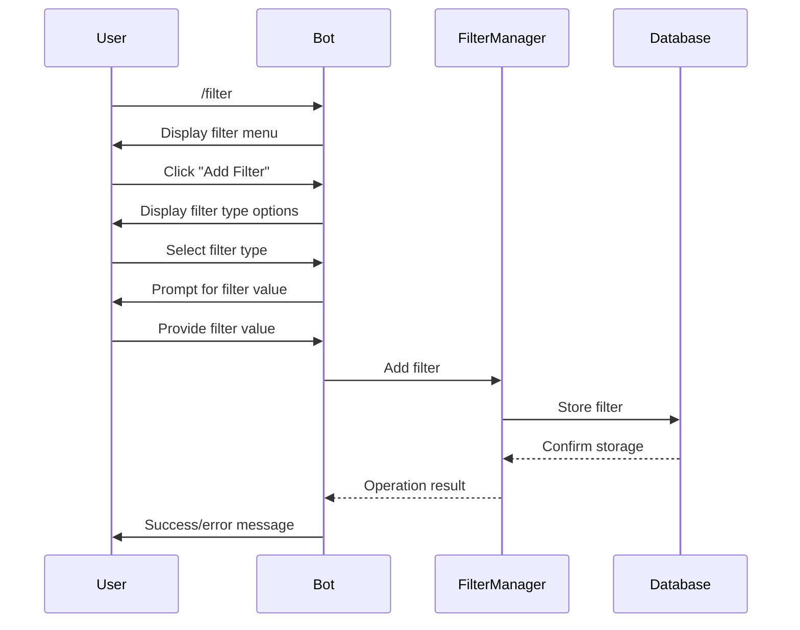

# Architecture Decision Record: Telegram Interactive Filter Management Interface

## Status
Proposed

## Context
The current system implements filter management through multiple separate commands:
- `/filter_list`: Shows current filters for a topic
- `/filter_add_user @username`: Adds tweets from a user
- `/filter_add_mention @username`: Adds tweets mentioning a user
- `/filter_add_keyword word`: Adds tweets containing keyword
- `/filter_remove_user @username`: Removes user filter
- `/filter_remove_mention @username`: Removes mention filter
- `/filter_remove_keyword word`: Removes keyword filter

This approach has several limitations:
1. Users need to remember multiple command formats
2. Command syntax is verbose and not intuitive
3. No interactive guidance for users
4. Error handling is limited to text responses
5. Users must type complete commands for each operation

We need a more intuitive, user-friendly approach to filter management that enables users to:
- Add/remove search subjects directly within specific channels
- Access channel-specific configuration details
- Receive clear confirmation messages after successful updates

## Decision
We will implement a simplified, interactive filter management interface with the following features:

1. **Single Entry Command**: Replace the multiple filter commands with a single `/filter` command that launches an interactive interface.

2. **Interactive Button Interface**: When a user types `/filter`, the bot will respond with a message containing inline buttons for different filter operations:
   - View Filters
   - Add Filter
   - Remove Filter
   - Filter Info

3. **Guided Flow**: Each button will trigger a specific flow:
   - **View Filters**: Display current filters with options to edit or remove
   - **Add Filter**: Present filter type options (user, mention, keyword) and prompt for value
   - **Remove Filter**: Show existing filters with remove buttons
   - **Filter Info**: Show channel-specific configuration details

4. **Contextual Responses**: Each interaction will maintain context, allowing multi-step operations without requiring users to type full commands repeatedly.

5. **Clear Feedback**: Provide visual confirmation of all operations with success/error indicators.

## Alternatives Considered

### 1. Simplified Command Set
Replace the current commands with simpler versions like `/add`, `/remove`, and `/info`.

**Pros:**
- Shorter commands
- Easier to remember
- Maintains command-based interface

**Cons:**
- Still requires users to remember command syntax
- No interactive guidance
- Limited error recovery options

### 2. Slash Commands with Arguments
Keep the current approach but simplify the command names and improve help text.

**Pros:**
- Familiar to existing users
- Simple implementation
- Works in all Telegram clients

**Cons:**
- Not intuitive for new users
- Requires precise syntax
- No interactive elements

### 3. Custom Keyboard Buttons
Add persistent custom keyboard buttons for filter operations.

**Pros:**
- Always visible options
- No need to type commands
- Very user-friendly

**Cons:**
- Takes screen space
- Less flexible for power users
- May interfere with normal typing

## Consequences

### Positive
- More intuitive user experience
- Reduced learning curve for new users
- Guided flows reduce user errors
- Interactive feedback improves user confidence
- Consistent interface across filter operations
- Separation of UI from business logic improves maintainability

### Negative
- More complex implementation than simple commands
- Requires additional state management for multi-step interactions
- May require users to adapt to new workflow
- Inline buttons may not be as visible as commands in help text

### Neutral
- Changes the interaction model from command-based to interactive
- Shifts some complexity from users to the system

## Implementation Details

### Command Handler
```typescript
// Single entry point command
this.telegramBot.onText(/^\/filter$/, async (msg) => {
  if (!msg.message_thread_id) {
    await this.queueMessage({
      text: '❌ This command must be used in a topic',
      parse_mode: 'HTML'
    });
    return;
  }

  await this.sendFilterMenu(msg.chat.id, msg.message_thread_id);
});
```

### Interactive Menu
```typescript
private async sendFilterMenu(chatId: number, threadId: number): Promise<void> {
  const keyboard = {
    inline_keyboard: [
      [{ text: "👁️ View Filters", callback_data: `filter_view_${threadId}` }],
      [{ text: "➕ Add Filter", callback_data: `filter_add_menu_${threadId}` }],
      [{ text: "➖ Remove Filter", callback_data: `filter_remove_menu_${threadId}` }],
      [{ text: "ℹ️ Filter Info", callback_data: `filter_info_${threadId}` }]
    ]
  };

  await this.telegramBot.sendMessage(chatId, "📋 *Filter Management*\nSelect an option:", {
    parse_mode: 'MarkdownV2',
    reply_markup: keyboard,
    message_thread_id: threadId
  });
}
```

### Callback Query Handling
```typescript
this.telegramBot.on('callback_query', async (query) => {
  const callbackData = query.data;
  
  if (callbackData.startsWith('filter_')) {
    await this.handleFilterCallback(query);
  }
});
```

### Data Flow


## Compliance Requirements
- All filter operations will maintain the same permission checks as the current system
- Filter validation rules remain unchanged
- All operations will be logged with the same detail level as current commands

## Metrics and Monitoring
- Add tracking for interactive menu usage
- Monitor completion rates for multi-step flows
- Track error rates by operation type
- Measure user engagement with the new interface

## Rollout Plan
1. Implement the new interface
2. Monitor usage patterns and gather feedback
3. Gather metrics on user engagement and success rates