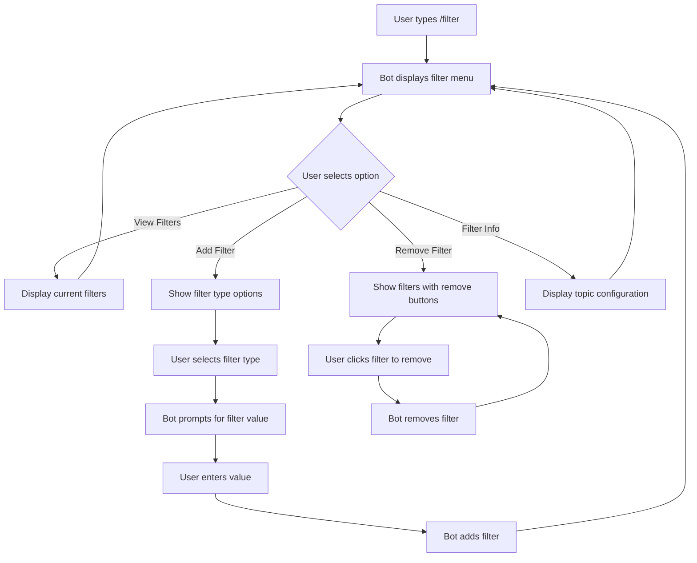

# Telegram Filter Management Interface - Summary

## Overview

The new Telegram filter management interface provides an intuitive, interactive way for users to manage search filters directly within Telegram channels. This document summarizes the key features, benefits, and implementation approach.

## Key Features

### 1. Single Entry Command

The interface is accessed through a single `/filter` command that launches an interactive menu with buttons for different operations:

- **View Filters**: See all current filters for the topic
- **Add Filter**: Add new filters with guided selection
- **Remove Filter**: Remove existing filters with one-click buttons
- **Filter Info**: View comprehensive topic configuration details

### 2. Interactive Button Interface

Instead of requiring users to type complex commands, the new interface uses Telegram's inline buttons to guide users through filter management:

### 3. Guided Multi-Step Flows

The interface walks users through complex operations step by step:

1. User types `/filter`
2. Bot displays menu with operation buttons
3. User selects an operation (e.g., "Add Filter")
4. Bot guides user through necessary steps
5. Bot confirms successful completion

### 4. Contextual Feedback

Each action provides immediate visual feedback:

- ✅ Success indicators for completed operations
- ❌ Error messages with clear explanations
- 🔄 Navigation options to continue or return to the menu

## Benefits

### For Users

- **Reduced Complexity**: No need to remember multiple command formats
- **Guided Experience**: Clear options at each step prevent errors
- **Visual Confirmation**: Immediate feedback for all operations
- **Contextual Help**: Options relevant to the current context
- **Reduced Typing**: Most operations require minimal typing

### For Administrators

- **Reduced Support Burden**: Fewer user errors means less support needed
- **Consistent Operations**: Standardized flows for all filter operations
- **Better Visibility**: Clear overview of configured filters
- **Improved Adoption**: Lower barrier to entry for new users

### For Developers

- **Modular Design**: Easier to extend with new filter types
- **Separation of Concerns**: UI logic separated from business logic
- **Improved Error Handling**: Structured approach to error management
- **Better Metrics**: Clearer tracking of user interactions

## Implementation Approach

The implementation follows a modular approach:

1. **Single Entry Point**: The `/filter` command serves as the entry point
2. **Callback Query Handling**: All button interactions use Telegram's callback query system
3. **Session Management**: Temporary state tracking for multi-step operations
4. **Modular Handlers**: Separate handlers for different operations
5. **Simplified Command Interface**: Single command replaces multiple legacy commands

## User Experience Flow

## Rollout Timeline

1. **Development Phase**: 2 weeks
   - Implementation of core functionality
   - Internal testing and refinement

2. **Limited Release**: 1 week
   - Deploy to select topics
   - Gather feedback and metrics

3. **Full Release**: 1 week
   - Enable for all topics
   - Complete removal of legacy commands

## Conclusion

The new Telegram filter management interface significantly improves the user experience for managing search filters. By providing an intuitive, guided approach with visual feedback, it reduces the learning curve and potential for errors while maintaining all the functionality of the previous command-based system.

This enhancement aligns with the project's goals of improving usability and making the system more accessible to users of all technical levels.